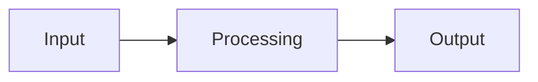
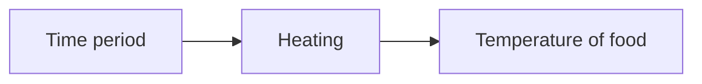
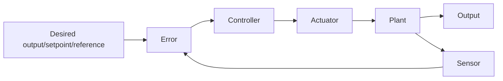

# 02 Control Systems

!!! note "Syllabus points"
    - 6.1.7 Outline OS resource management techniques: ... interrupt, polling
    - 7.1.1 Discuss a range of control systems
    - 7.1.2 Outline the uses of microprocessors and sensor input in control systems
    - 7.1.3 Evaluate different input devices for the collection of data in specific situations
    - 7.1.4 Explain the relationship between a sensor, the processor and an output transducer
    - 7.1.5 Describe the role of feedback in a control system
    - 7.1.6 Discuss the social impacts and ethical considerations associated with the use of embedded systems
    - 7.1.7 Compare a centrally controlled system with a distributed system
    - 7.1.8 Outline the role of autonomous agents acting within a larger system

## Control system

A control system is a type of computer system that **manages and directs** other devices or systems.

Control systems take an input, process this according to the rules of the system and cause an output, often using a motor or other actuator.

1. Measurement of the process variable (input)
2. Evaluation and comparison with the desired level (processing)
3. Control of the required level of the parameter involved (output)

## Components

### Transducer

A transducer is a device that converts signals in one form of energy into another (e.g. microphone - sound waves into electrical signals).

- Input physical, output electrical: sensor (+ ADC)
- Input electrical, output physical: actuator (+ DAC)

Advantages of transducers: can convert signals into electric form

- Ease of **amplification**
- Ease of **integration** and **differentiation**
- Ease of **convertibility** from analogue to digital and vice versa
- **Remote controllability** and easy **data transmission** capabilities
- Compatibility with **microprocessors** and **computers**

### Sensor

A sensor is an input device that continuously takes readings of the environment.

Types of sensors:

- Temperature (thermometer)
- Light
- Infrared
- Sound/voice
- Pressure
- Motion
- Humidity
- pH
- Gas
- Magnetic
- Position
- Proximity
- Touch

### Analogue-to-digital converter (ADC)

An ADC is a device that converts an analogue (continuous) signal into a digital (discrete, binary) signal.

- Collecting data: sampling
- Converting data to e.g. binary: quantisation

### Microprocessor

A microprocessor compares the input converted by the ADC to pre-defined/stored/preset values.

### Digital-to-analogue converter (DAC)

A DAC is a device that converts a digital signal into an analogue signal for an actuator.

### Actuator

An actuator is an output device that executes a physical action (e.g. fan, motor, pump, light) (*actua*lly does something).

## Examples

|                  | Input (sensors)                                                   | Processing                                                                                                                | Output (actuators)                                                                                                                                                |
| ---------------- | ----------------------------------------------------------------- | ------------------------------------------------------------------------------------------------------------------------- | ----------------------------------------------------------------------------------------------------------------------------------------------------------------- |
| Automatic doors  | Motion sensor, infrared light beam (light sensor), pressure pad   | If it detects something beyond the set parameters - something that isn’t usually there, a signal is sent to open the door | Door opens (door engines / motors) Motor opens/closes the door.                                                                                                   |
| Heating systems  | Temperature sensor, timer                                         | compare temperature input to the preset range.                                                                            | Switch on/off heater / refrigeration unit                                                                                                                         |
| Taxi meters      | Timer, odometer, sensor to measure rotation of axle               | Algorithm that converts distance/time to money                                                                            | Continuously displays increasing fare on screen                                                                                                                   |
| Elevators        | Motion sensor, pressure sensor,                                   | Counts holes in lift shaft to calculate where it is. Measures weight inside elevator                                      | Motor speed varies (slows as you approach required floor) door opens when you reach the floor, alarm goes off if overloaded, doors reopen if something in the way |
| Washing machines | Temperature sensor, pressure sensor, speed sensor, buttons        | Algorithm that measures how long and how much water the machine needs to wash the clothes in                              | Timer display, LEDs showing whether the machine is on or not                                                                                                      |
| Process control  | Pressure sensor, temperature sensor, switch, motion sensor, timer | Dependent on what is being processed                                                                                      | Motor, heater, robotic arm                                                                                                                                        |
| Device drivers   | No sensor input - data                                            |                                                                                                                           | Motor, print head/valve on nozzle, speaker                                                                                                                        |
| Domestic robots  | Pressure sensor, camera, infrared                                 | Depends on task                                                                                                           | Algorithm that determines how to process the data                                                                                                                 |
| GPS systems      | GPS receiver                                                      | Trilateration                                                                                                             | Display of location as co-ordinates or combined with other software to plot on map                                                                                |
| Traffic lights   | Induction loop in road                                            | Calculate how long traffic light needs to be on to allow all the cars to get through, combined with timer                 | Change in the colour of the lights in preset order…                                                                                                               |

## Benefits and limitations

### Benefits

- Consistency and accuracy in the positioning of moving parts of an equipment
- The more economic use of existing plants (by saving fuel/and or electrical energy)
- The release of skilled personnel for other productive work
- Reduction of physical effort with consequent reduction of fatigue and boredom
- Improved working conditions

### Limitations

- The initial cost is high
- Power fluctuations (causing unpredictable results)
- Lack of skilled personnel to monitor and maintain specialist equipment

### Social and ethical impacts

A social issue is a problem that influences a considerable number of individuals within a **society**.

An ethical issue is a problem or situation that requires a person or organisation to choose between **alternatives** that must be evaluated as **right/ethical** or **wrong/unethical**.

#### Tagging prisoners

- Advantages
    - Allows **non-dangerous criminals** to move
    - Reduces the **number of people** needed to be **in prison**
    - Allows for **tracking** at all times
- Disadvantages
    - Loss of **freedom of movement**
    - Could be **hacked** to track innocent people
    - Tracking data could be **sold off to make money**

#### Surveillance

- Advantages
    - Allows for **greater security**
    - Could be used as effective **evidence in court cases**
    - Allows fewer people to have to **monitor others**
- Disadvantages
    - Loss of **privacy**
    - Could be **hacked** and used for unintended purposes
    - Could be used to **spy** on people (drones)

### Economic impact

- Improved profitability (reduced cost per unit)
- Improved, skilled workforce (creating an economic hub for other businesses to develop)
- Unfair advantages against less-developed nations

### Environmental impact

- Need for more raw materials (contributing to climate change)
- Increase in physical digital waste (disposal problems)

### Legal impact

- New technology/systems bring new legislation
- Laws in one country may be different to another

## Centralised and distributed systems

A centralised system is where all the processing is done in one place. This is often the case with embedded systems. The processing is done by a microprocessor, which is connected to the sensors and actuators.

- Advantages
    - **Easier** to administrate
    - More **control**
- Disadvantages
    - If the **main sensor/controller fails**, the whole system fails

A distributed system is where the processing is done in multiple places. This is often the case with networked systems. The processing is done by multiple microprocessors, which are connected to the sensors and actuators.

- Advantages
    - Quicker **access**
    - Shared **load**
    - Response more **specific** to the environment
- Disadvantages
    - More **expensive** to have multiple controllers/sensors
    - More **complex** than a centralised system

## Open- and closed-loop systems

### Open-loop system

An open-loop system only repeats a task given a set input.

e.g. for a microwave:

Sample steps of operation:

- The desired input is set/the start button is pushed
- A `<type of sensor>` detects `<type of input>`
- The analogue signal is converted to a digital signal
- The processor compares the input to a set value
- If the value is less/greater/outside the set range, the processor sends a signal to the output transducer (`<type of actuator>`) to increase/decrease the `<type of output>`

e.g. a washing machine (N19 HP1):

- The start button is pushed
- A water level sensor detects the water level
- The analogue signal is converted to a digital signal
- The processor compares the input to a set value
- If the value reaches the set value, the processor sends a signal to the output transducer (water valve) to stop the water supply

### Closed-loop system

A closed-loop system can take into account the output of the system and adjust the input accordingly.

The target is to minimise the error (difference between the desired output and the actual output).

- Disturbance: unwanted variation in the system (e.g. from the environment - icy roads in a car)
- Noise: measurement error from the technology used in the sensor

Sample steps of operation:

- The desired input is set
- A `<type of sensor>` detects `<type of output>`
- The analogue signal is converted to a digital signal
- And sent back to the processor
- The error/difference between the desired input and the actual output is calculated
- The difference is compared to a set value to determine if the `<type of output>` needs to be adjusted
- If the output should be adjusted by an amount dependent upon the error, the processor sends a signal to the output transducer (`<type of actuator>`) to increase/decrease the `<type of output>`
- The above process is repeated continually

e.g. a speed controller in a motor (M17 HP1):

- The desired speed is set
- A speed sensor detects the speed of the motor
- The analogue signal is converted to a digital signal
- And sent back to the processor
- The error/difference between the desired speed and the actual speed is calculated
- The difference is compared to a set value to determine if the speed of the motor needs to be adjusted
- If the output should be adjusted by an amount dependent upon the error, the processor sends a signal to the output transducer (motor) to increase/decrease the speed of the motor
- The above process is repeated continually

## Autonomous agent

An autonomous agent is a softer entity that can carry out tasks on behalf of a user with some degree of independence/autonomy by employing some knowledge or representation of the user's goals or desires.

Features of an autonomous agent:

- **Autonomy**: the ability to activate itself and select actions without direct human intervention
- **Reactive behaviour**: the ability to respond to changes in the environment
- **Concurrency/sociality**: the ability to interact with other agents through communication (coordination, cooperation, competition)
- **Persistence**: the ability to run continuously and not on demand
