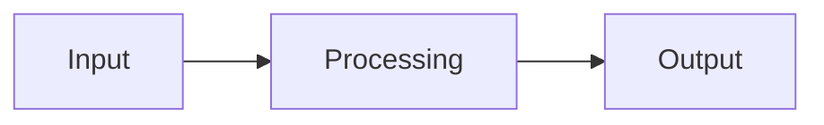
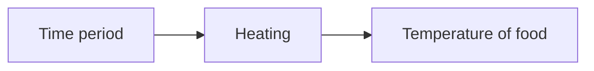
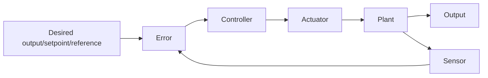

# 02 Control Systems

## Control system

A control system is a type of computer system that **manages and directs** other devices or systems.

Control systems take an input, process this according to the rules of the system and cause an output, often using a motor or other actuator.

1. Measurement of the process variable (input)
2. Evaluation and comparison with the desired level (processing)
3. Control of the required level of the parameter involved (output)

## Key elements

### Transducer

A transducer is a device that converts signals in one form of energy into another (e.g. microphone - sound waves into electrical signals).

- Input physical, output electrical: sensor (+ ADC)
- Input electrical, output physical: actuator (+ DAC)

### Sensor

A sensor is an input device that continuously takes readings of the environment.

### Analogue-to-digital converter (ADC)

An ADC is a device that converts an analogue (continuous) signal into a digital (discrete, binary) signal.

- Collecting data: sampling
- Converting data to e.g. binary: quantisation

### Microprocessor

A microprocessor compares the input converted by the ADC to pre-defined/stored/preset values.

### Digital-to-analogue converter (DAC)

A DAC is a device that converts a digital signal into an analogue signal for an actuator.

### Actuator

An actuator is an output device that executes a physical action (e.g. fan, motor, pump, light) (*actua*lly does something).

## Benefits and limitations

### Benefits

- Consistency and accuracy in the positioning of moving parts of an equipment
- The more economic use of existing plants (by saving fuel/and or electrical energy)
- The release of skilled personnel for other productive work
- Reduction of physical effort with consequent reduction of fatigue and boredom
- Improved working conditions

### Limitations

- The initial cost is high
- Power fluctuations (causing unpredictable results)
- Lack of skilled personnel to monitor and maintain specialist equipment

### Social impact

- Loss of job (replaced by automated processes, robots, etc)
- Migration (need to move/travel further for employment)
- More free time (quality of life)

### Economic impact

- Improved profitability (reduced cost per unit)
- Improved, skilled workforce (creating an economic hub for other businesses to develop)
- Unfair advantages against less-developed nations

### Environmental impact

- Need for more raw materials (contributing to climate change)
- Increase in physical digital waste (disposal problems)

### Legal impact

- New technology/systems bring new legislation
- Laws in one country may be different to another

## Examples of control systems

See [this doc](https://docs.google.com/document/d/1mZYt2xFZAeeU8jlyYqiqSsCuTi2ByvX9gAHpsdSBNpU/edit).

## Open- and closed-loop systems

### Open-loop system

An open-loop system only repeats a task given a set input.

e.g. for a microwave:

### Closed-loop system

A closed-loop system can take into account the output of the system and adjust the input accordingly.

The target is to minimise the error (difference between the desired output and the actual output).

- Disturbance: unwanted variation in the system (e.g. from the environment - icy roads in a car)
- Noise: measurement error from the technology used in the sensor
