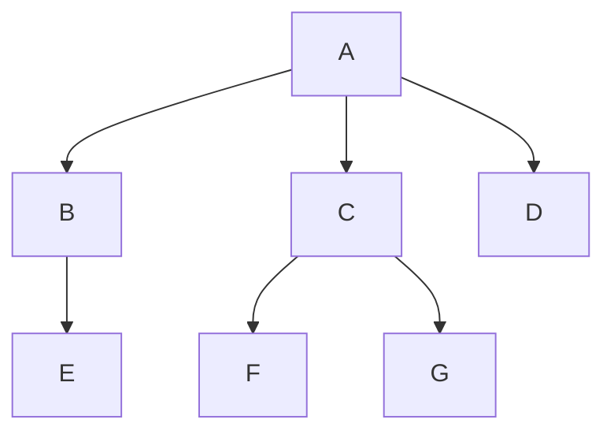

# 03 Abstract Data Structures

## Recursion

!!! info "Syllabus points"
    - 5.1.1 Identify a situation that requires the use of recursive thinking
    - 5.1.2 Identify recursive thinking in a specified problem solution
    - D.4.1 Define the term recursion

Recursion is the technique of **calling (a simpler version of) a function within itself**. Recursions need a **base case (ending condition**). It is useful for a large task that can be **broken down into repetitive sub-tasks**.

```java
int factorial(int n) {
    if (n == 0) {
        return 1;
    }
    return n * factorial(n - 1);
}
```

- Advantages
    - Simpler code (only need to define the **base case** and **recursive case**)
    - Some problems are **inherently recursive**, such as graph and tree traversal
    - Reduces the **length of the code** compared to iterative code
- Disadvantages
    - Generally **slower** than non-recursive functions (because each time the function is called, the stack grows and the final answer is returned when the stack is popped completely)
    - May require a lot of **memory space** to hold intermediate results on the system stacks; may **run out of memory** if recursive calls are not properly checked
    - Hard to **analyse or understand** the code

## Stack

!!! info "Syllabus points"
    - 5.1.10 Explain the use of arrays as static stacks and queues
    - D.4.14 Outline the features of ADT's stack, queue and binary tree

A stack is a data structure which operates on a first-in, last-out basis (**LIFO**). It uses a single pointer (**index**) to keep track of the data.

```ascii
+---+
| 3 | <-- top
+---+
| 2 |
+---+
| 1 |
+---+ 
```

### Features of stacks

- Made of a "chain" of data
- Elements can be "pushed" onto the top
- Elements can be "popped" from the top
- LIFO
- Accessing an element from an empty stack is an error

Basic operations:

- insert (**push**) an item onto the stack
- remove (**pop**) an item from the stack

### Applications of stacks

- Function calls (call stack): stores the return address of the function
- Expression evaluation and syntax parsing: stores the operators and operands (infix, postfix, prefix)
- Parenthesis matching: stores the opening parenthesis and pops them when a matching closing parenthesis is encountered
- String reversal: stores the characters of the string

### Push

```java
void push(int item) {
    if (top + 1 == MAX) {
        System.out.println("Stack is full");
        return;
    }
    stack[++top] = item;
}
```

### Pop

```java
int pop() {
    if (top == -1) {
        System.out.println("Stack is empty");
        return -1;
    }
    return stack[top--];
}
```

## Queue

!!! info "Syllabus points"
    - 5.1.10 Explain the use of arrays as static stacks and queues
    - D.4.14 Outline the features of ADT's stack, queue and binary tree

A queue is a data structure which operates on a first-in, first-out basis (**FIFO**). It uses **2 pointers** to keep track of the **HEAD** and the **TAIL** of the queue.

```ascii
+---+---+---+---+---+---+---+---+---+---+
| 0 | 1 | 2 | 3 | 4 | 5 | 6 | 7 | 8 | 9 |
+---+---+---+---+---+---+---+---+---+---+
  ^                                   ^
  |                                   |
 head                                tail
```

### Features of queues

- Made of a "chain" of data
- Elements can be "enqueued" at the back (tail) of the queue
- Elements can be "dequeued" from the front (head) of the queue
- FIFO
- Accessing an element from an empty queue is an error

Basic operations:

- insert (enqueue) an item into the queue
- remove (dequeue) an item from the queue

### Enqueue

```java
void enqueue(int item) {
    if (tail + 1 == MAX) {
        System.out.println("Queue is full");
        return;
    }
    queue[++tail] = item;
}
```

Circular queue:

```java
void enqueue(int item) {
    if (size == MAX) {
        System.out.println("Queue is full");
        return;
    }
    tail = (tail + 1) % MAX;
    queue[tail] = item;
    ++size;
}
```

### Dequeue

```java
int dequeue() {
    if (head == tail) {
        System.out.println("Queue is empty");
        return -1;
    }
    return queue[head++];
}
```

Circular queue:

```java
int dequeue() {
    if (size == 0) {
        System.out.println("Queue is empty");
        return -1;
    }
    int item = queue[head];
    head = (head + 1) % MAX;
    --size;
    return item;
}
```

## Linked list

!!! info "Syllabus points"
    - 5.1.11 Describe the features and characteristics of a dynamic data structure
    - 5.1.12 Describe how linked lists operate logically
    - 5.1.13 Sketch linked lists (single, double and circular)
    - 5.1.18 Define the term dynamic data structure
    - 5.1.19 Compare the use of static and dynamic data structures
    - D.4.7 Identify the features of the abstract data type (ADT) list
    - D.4.8 Describe applications of lists

### Static and dynamic data structures

A static data structure is **fixed in size** and **cannot be resized** (e.g. a static array). It is **stored in contiguous memory**, and content is modified **without** changing the memory address allocated.

A dynamic data structure is **not fixed in size** and **can be resized** during operations (e.g. a linked list). The memory address is allocated **at runtime**.

| Difference        | Static data structure             | Dynamic data structure            |
| ----------------- | --------------------------------- | --------------------------------- |
| Memory allocation | At compile time                   | At runtime                        |
| Size              | Fixed                             | Variable                          |
| Memory usage      | Less                              | More                              |
| Access time       | Fast                              | Slow                              |
| Examples          | Array, stack, queue, tree (fixed) | List, tree (variable), hash table |

- Advantages of static data structures
    - **Faster** access time
        - The memory address is known at **compile time** and is **fixed**
        - Accessing elements by **indexing**
    - Predictable **memory usage**
        - The programmer can **predict** the memory usage
    - Efficient **memory management**
        - The memory can be **allocated** and **released** efficiently
        - No frequent **reallocations** and **memory copies**
    - Reduced **overhead**
        - Do not require **extra bookkeeping** to manage memory allocation and deallocation
    - Easy to **implement** and **optimise**
        - Algorithms can be **optimised**, reducing **cache misses**
        - Code can be **simplified** by **removing** dynamic memory allocation features and the error-handling code associated with it
- Advantages of dynamic data structures
    - **Flexibility** and **scalability**
        - Can **grow** and **shrink** at runtime as needed
        - **Adapt** to changes in the data
        - Suitable for **unknown/variable data size**
    - Reduce **memory waste**
        - No need to reserve **extra space** beforehand that may not be used in the future
    - Improved **performance** for certain operations
        - **Insertion and deletion in the middle** are faster as **shifting** of elements is not required (only the pointers need to be updated)
    - **Simplify** code
        - Removes the need to check for **overflow** and **underflow** and manual **memory management**
        - Reduce **code complexity** for data structures that need to be **resized** frequently

### Singly-linked list

A singly-linked list is a **dynamic data structure** that consists of a **sequence of nodes**. Each node contains a **data field** and a **pointer** to the next node in the sequence.

```ascii
         +---|---+   +---|---+   +---|---+   +---|---+
head --> | 1 | o---->| 2 | o---->| 3 | o---->| 4 | o----> NULL
         +---|---+   +---|---+   +---|---+   +---|---+
```

```java
class SNode {
    int data;
    SNode next = null;

    SNode(int data) {
        this.data = data;
    }
}

class SLinkedList {
    SNode head = null;
    // ...
}
```

#### Traversal of a singly-linked list

```java
void traverse() {
    SNode current = head;
    while (current != null) {
        System.out.print(current.data + " ");
        current = current.next;
    }
    System.out.println();
}
```

#### Insertion into a singly-linked list

```java
void insertAtBeginning(int item) {
    SNode newNode = new SNode(item);
    newNode.next = head;
    head = newNode;
}

void insertAtEnd(int item) {
    SNode newNode = new SNode(item);
    if (head == null) {
        head = newNode;
        return;
    }
    SNode current = head;
    while (current.next != null) {
        current = current.next;
    }
    current.next = newNode;
}

void insertAt(int item, int index) {
    SNode newNode = new SNode(item);
    if (index == 0) {
        insertAtBeginning(item);
        return;
    }

    // If not inserting at front and list is empty
    if (head == null) {
        System.out.println("Cannot insertAt " + index + ": Position not found");
        return;
    }

    // We start at 1 so that we can actually get the node before the target position
    int count = 1;
    SNode last = head;
    while (last.next != null && count < index) {
        last = last.next;
        count++;
    }
    if (count == index) {
        newNode.next = last.next;
        last.next = newNode;
    } else {
        System.out.println("Cannot insertAt " + index + ": Position not found");
    }
}
```

#### Deletion from a singly-linked list

```java
void deleteAtBeginning() {
    if (head == null) {
        System.out.println("List is empty");
        return;
    }
    head = head.next;
}

void deleteAtEnd() {
    if (head == null) {
        System.out.println("List is empty");
        return;
    }
    if (head.next == null) {
        head = null;
        return;
    }
    SNode current = head;
    while (current.next.next != null) {
        current = current.next;
    }
    current.next = null;
}

void deleteAt(int index) {
    if (head == null) {
        System.out.println("List is empty");
        return;
    }
    if (index == 0) {
        head = head.next;
        return;
    }

    // We start at 1 so that we can actually get the node before the target position
    int count = 1;
    SNode last = head;
    while (last.next != null && count < index) {
        last = last.next;
        count++;
    }
    if (count == index) {
        last.next = last.next.next;
    } else {
        System.out.println("Cannot deleteAt " + index + ": Position not found");
    }
}
```

### Doubly-linked list

A doubly-linked list is a **dynamic data structure** that consists of a **sequence of nodes**. Each node contains a **data field** and **pointers** to the **previous** and **next** nodes in the sequence.

```ascii
         +---|---|---+   +---|---|---+   +---|---|---+   +---|---|---+
NULL <-----o | 1 | o=======o | 2 | o=======o | 3 | o=======o | 4 | o-----> NULL
         +---|---|---+   +---|---|---+   +---|---|---+   +---|---|---+
```

```java
class DNode {
    int data;
    DNode prev = null;
    DNode next = null;

    DNode(int data) {
        this.data = data;
    }
}

class DLinkedList {
    DNode head = null;
    // ...
}
```

#### Traversal of a doubly-linked list

```java
void traverse() {
    DNode current = head;
    while (current != null) {
        System.out.print(current.data + " ");
        current = current.next;
    }
    System.out.println();
}
```

#### Insertion into a doubly-linked list

```java
void insertAtBeginning(int item) {
    DNode newNode = new DNode(item);
    newNode.next = head;
    if (head != null) {
        head.prev = newNode;
    }
    head = newNode;
}

void insertAtEnd(int item) {
    DNode newNode = new DNode(item);
    if (head == null) {
        head = newNode;
        return;
    }
    DNode current = head;
    while (current.next != null) {
        current = current.next;
    }
    current.next = newNode;
    newNode.prev = current;
}

void insertAt(int item, int index) {
    DNode newNode = new DNode(item);
    if (index == 0) {
        insertAtBeginning(item);
        return;
    }

    // If not inserting at front and list is empty
    if (head == null) {
        System.out.println("Cannot insertAt " + index + ": Position not found");
        return;
    }

    // We start at 1 so that we can actually get the node before the target position
    int count = 1;
    DNode last = head;
    while (last.next != null && count < index) {
        last = last.next;
        count++;
    }
    if (count == index) {
        newNode.next = last.next;
        if (last.next != null) {
            last.next.prev = newNode;
        }
        newNode.prev = last;
        last.next = newNode;
    } else {
        System.out.println("Cannot insertAt " + index + ": Position not found");
    }
}
```

#### Deletion from a doubly-linked list

```java
void deleteAtBeginning() {
    if (head == null) {
        System.out.println("List is empty");
        return;
    }
    head = head.next;
    if (head != null) {
        head.prev = null;
    }
}

void deleteAtEnd() {
    if (head == null) {
        System.out.println("List is empty");
        return;
    }
    if (head.next == null) {
        head = null;
        return;
    }
    DNode current = head;
    while (current.next.next != null) {
        current = current.next;
    }
    current.next = null;
}

void deleteAt(int index) {
    if (head == null) {
        System.out.println("List is empty");
        return;
    }
    if (index == 0) {
        head = head.next;
        if (head != null) {
            head.prev = null;
        }
        return;
    }

    // We start at 1 so that we can actually get the node before the target position
    int count = 1;
    DNode last = head;
    while (last.next != null && count < index) {
        last = last.next;
        count++;
    }
    if (count == index) {
        last.next = last.next.next;
        if (last.next != null) {
            last.next.prev = last;
        }
    } else {
        System.out.println("Cannot deleteAt " + index + ": Position not found");
    }
}
```

## Trees

!!! info "Syllabus points"
    - 5.1.14 Describe how trees operate logically (both binary and non-binary)
    - 5.1.15 Define the terms: parent, left-child, right-child, subtree, root and leaf
    - 5.1.16 State the result of in order, postorder and preorder tree traversal
    - 5.1.17 Sketch binary trees
    - D.4.14 Outline the features of ADT's stack, queue and binary tree

A tree is a **hierarchical/non-linear data structure**. It consists of a **set of nodes** that are **connected by edges** (a graph with no cycles).



| Term      | Definition                                                                        |
| --------- | --------------------------------------------------------------------------------- |
| Key       | the value of a node                                                               |
| Root      | the top node                                                                      |
| Child     | the node below another node                                                       |
| Parent    | the node above another node                                                       |
| Leaf      | a node with no children                                                           |
| Level     | the distance from the root to a node                                              |
| Height    | the maximum level in a tree                                                       |
| Path      | a sequence of nodes and edges from one node to another                            |
| Subtree   | a set of nodes and edges comprised of a parent and all descendants of that parent |
| Traversal | the process of visiting each node in a tree                                       |
| Visiting  | to arrive at a node to operate (as opposed to passing through)                    |

### Features of binary trees

- Made of nodes with **two pointers** - left (less) and right (greater)
- Can only have 0, 1 or 2 children
- Assembled from the root node
- The root node of a balanced tree contains the middle value
- Naturally sorted
- Searching is binary

### Implementation of a binary tree

```java
class Node {
    int data;
    Node left = null;
    Node right = null;

    Node(int data) {
        this.data = data;
    }
}

class BinaryTree {
    Node root = null;

    void insert(int item) {
        Node newNode = new Node(item);
        if (root == null) {
            root = newNode;
            return;
        }
        Node current = root;
        while (true) {
            if (item < current.data) {
                if (current.left == null) {
                    current.left = newNode;
                    return;
                }
                current = current.left;
            } else {
                if (current.right == null) {
                    current.right = newNode;
                    return;
                }
                current = current.right;
            }
        }
    }

    Node getSuccessor(Node node) {
        // A successor is the smallest node in the right subtree

        Node parent = node;
        Node successor = node;
        Node current = node.right;

        // Go to the left as far as possible
        while (current != null) {
            parent = successor;
            successor = current;
            current = current.left;
        }

        // If the successor is not the right child, move the successor's right child up to the successor's position
        if (successor != node.right) {
            parent.left = successor.right;
            successor.right = node.right;
        }

        return successor;
    }

    void delete(int item) {
        if (root == null) {
            System.out.println("Tree is empty");
            return;
        }

        // Find the node to delete
        Node current = root;
        Node parent = null;
        while (current != null) {
            if (item == current.data) {
                break;
            }
            parent = current;
            if (item < current.data) {
                current = current.left;
            } else {
                current = current.right;
            }
        }
        if (current == null) {
            System.out.println("Item not found");
            return;
        }

        // Case 1: No children (leaf node)
        // Just remove the node
        if (current.left == null && current.right == null) {
            if (parent == null) {
                root = null;
            } else {        
                if (current == parent.left) {
                    parent.left = null;
                } else {
                    parent.right = null;
                }
            }
        }
        // Case 2: One child
        // Replace the node with its child
        else if (current.left == null) {
            if (parent == null) {
                root = current.right;
            } else {
                if (current == parent.left) {
                    parent.left = current.right;
                } else {
                    parent.right = current.right;
                }
            }
        } else if (current.right == null) {
            if (parent == null) {
                root = current.left;
            } else {
                if (current == parent.left) {
                    parent.left = current.left;
                } else {
                    parent.right = current.left;
                }
            }
        }
        // Case 3: Two children
        // Replace the node with its successor
        else {
            Node successor = getSuccessor(current);
            if (parent == null) {
                root = successor;
            } else {
                if (current == parent.left) {
                    parent.left = successor;
                } else {
                    parent.right = successor;
                }
            }
            successor.left = current.left;
        }
    }

    void printInOrder(Node node) {
        if (node == null) {
            return;
        }
        printInOrder(node.left);
        System.out.print(node.data + " ");
        printInOrder(node.right);
    }

    void printPreOrder(Node node) {
        if (node == null) {
            return;
        }
        System.out.print(node.data + " ");
        printPreOrder(node.left);
        printPreOrder(node.right);
    }

    void printPostOrder(Node node) {
        if (node == null) {
            return;
        }
        printPostOrder(node.left);
        printPostOrder(node.right);
        System.out.print(node.data + " ");
    }
}
```

### Capture-the-flag traversal technique

- In-order traversal: the flag is on the bottom of each node
- Pre-order traversal: the flag is on the left of each node
- Post-order traversal: the flag is on the right of each node


