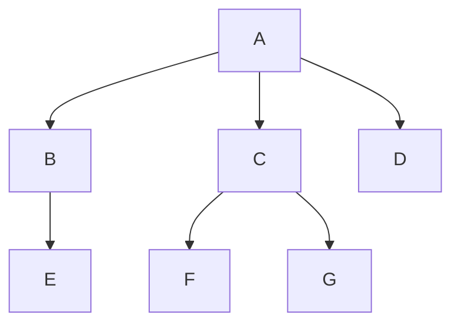

# 03.5 ADT Trees

!!! info "Syllabus points"
    - 5.1.14 Describe how trees operate logically (both binary and non-binary)
    - 5.1.15 Define the terms: parent, left-child, right-child, subtree, root and leaf
    - 5.1.16 State the result of in order, postorder and preorder tree traversal
    - 5.1.17 Sketch binary trees
    - D.4.14 Outline the features of ADT's stack, queue and binary tree

A tree is a **hierarchical/non-linear data structure**. It consists of a **set of nodes** that are **connected by edges** (a graph with no cycles).



| Term      | Definition                                                                        |
| --------- | --------------------------------------------------------------------------------- |
| Key       | the value of a node                                                               |
| Root      | the top node                                                                      |
| Child     | the node below another node                                                       |
| Parent    | the node above another node                                                       |
| Leaf      | a node with no children                                                           |
| Level     | the distance from the root to a node                                              |
| Height    | the maximum level in a tree                                                       |
| Path      | a sequence of nodes and edges from one node to another                            |
| Subtree   | a set of nodes and edges comprised of a parent and all descendants of that parent |
| Traversal | the process of visiting each node in a tree                                       |
| Visiting  | to arrive at a node to operate (as opposed to passing through)                    |

## Features of binary trees

- Made of nodes with **two pointers** - left (less) and right (greater)
- Can only have 0, 1 or 2 children
- Assembled from the root node
- The root node of a balanced tree contains the middle value
- Naturally sorted
- Searching is binary

## Implementation of a binary tree

```java
class Node {
    int data;
    Node left = null;
    Node right = null;

    Node(int data) {
        this.data = data;
    }
}

class BinaryTree {
    Node root = null;

    void insert(int item) {
        Node newNode = new Node(item);
        if (root == null) {
            root = newNode;
            return;
        }
        Node current = root;
        while (true) {
            if (item < current.data) {
                if (current.left == null) {
                    current.left = newNode;
                    return;
                }
                current = current.left;
            } else {
                if (current.right == null) {
                    current.right = newNode;
                    return;
                }
                current = current.right;
            }
        }
    }

    Node getSuccessor(Node node) {
        // A successor is the smallest node in the right subtree

        Node parent = node;
        Node successor = node;
        Node current = node.right;

        // Go to the left as far as possible
        while (current != null) {
            parent = successor;
            successor = current;
            current = current.left;
        }

        // If the successor is not the right child, move the successor's right child up to the successor's position
        if (successor != node.right) {
            parent.left = successor.right;
            successor.right = node.right;
        }

        return successor;
    }

    void delete(int item) {
        if (root == null) {
            System.out.println("Tree is empty");
            return;
        }

        // Find the node to delete
        Node current = root;
        Node parent = null;
        while (current != null) {
            if (item == current.data) {
                break;
            }
            parent = current;
            if (item < current.data) {
                current = current.left;
            } else {
                current = current.right;
            }
        }
        if (current == null) {
            System.out.println("Item not found");
            return;
        }

        // Case 1: No children (leaf node)
        // Just remove the node
        if (current.left == null && current.right == null) {
            if (parent == null) {
                root = null;
            } else {        
                if (current == parent.left) {
                    parent.left = null;
                } else {
                    parent.right = null;
                }
            }
        }
        // Case 2: One child
        // Replace the node with its child
        else if (current.left == null) {
            if (parent == null) {
                root = current.right;
            } else {
                if (current == parent.left) {
                    parent.left = current.right;
                } else {
                    parent.right = current.right;
                }
            }
        } else if (current.right == null) {
            if (parent == null) {
                root = current.left;
            } else {
                if (current == parent.left) {
                    parent.left = current.left;
                } else {
                    parent.right = current.left;
                }
            }
        }
        // Case 3: Two children
        // Replace the node with its successor
        else {
            Node successor = getSuccessor(current);
            if (parent == null) {
                root = successor;
            } else {
                if (current == parent.left) {
                    parent.left = successor;
                } else {
                    parent.right = successor;
                }
            }
            successor.left = current.left;
        }
    }

    void printInOrder(Node node) {
        if (node == null) {
            return;
        }
        printInOrder(node.left);
        System.out.print(node.data + " ");
        printInOrder(node.right);
    }

    void printPreOrder(Node node) {
        if (node == null) {
            return;
        }
        System.out.print(node.data + " ");
        printPreOrder(node.left);
        printPreOrder(node.right);
    }

    void printPostOrder(Node node) {
        if (node == null) {
            return;
        }
        printPostOrder(node.left);
        printPostOrder(node.right);
        System.out.print(node.data + " ");
    }
}
```

## Capture-the-flag traversal technique

- In-order traversal: the flag is on the bottom of each node
- Pre-order traversal: the flag is on the left of each node
- Post-order traversal: the flag is on the right of each node


