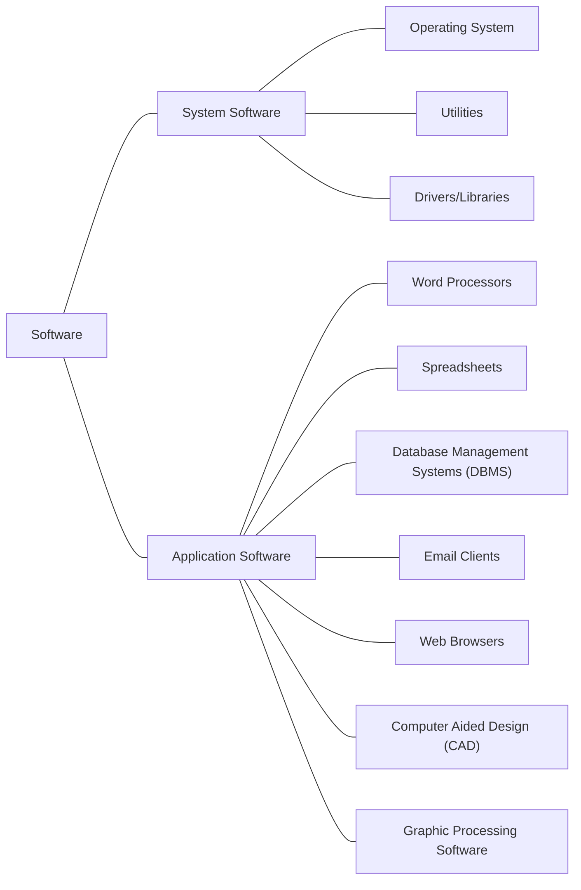

# 03b OS & Applications

!!! info "Syllabus points"
    - 2.1.6 Describe the main functions of an operating system.
    - 2.1.7 Outline the use of a range of application software, including:
        - Word processors,
        - Spreadsheets,
        - Database management systems,
        - Email,
        - Web browsers,
        - Computer-aided design (CAD) and
        - Graphic processing software.
    - 2.1.8 Identify common features of applications, which include:
        - toolbars,
        - menus,
        - dialogue boxes,
        - graphical user interface (GUI) components.

## Hierarchy of software

## System software

System software is a program (or sequence of instructions) designed to manage or maintain a **computer**, its **peripherals** and its **performance**. It only exists **because computers exist**.

{ width="300" }

- Provides a user interface
- Does memory management
- Does peripheral management
- Allows multi-tasking
- Provides security

### User interface

OS has to provide a **link** between the user and the computer hardware so it is easy to **interact with** the computer.

- Graphical User Interface (GUI) has menus and icons
- Command Line Interface (CLI) where the user types in code
- Natural Language Interface (NLI) where the user speaks to the
interface
- Menu-Based Interface (MBI) which gives the user a selection of
options

| Difference             | CLI                                                   | GUI                                               |
| ---------------------- | ----------------------------------------------------- | ------------------------------------------------- |
| Ease of use            | Difficult                                             | Easy                                              |
| Memory consumption     | Low                                                   | High                                              |
| Precision              | High                                                  | Low                                               |
| Speed                  | Faster                                                | Slower                                            |
| Peripherals            | Keyboard                                              | Mouse and keyboard                                |
| Pointing devices       | No                                                    | Yes                                               |
| Appearance modifiable? | Yes                                                   | No                                                |
| Input                  | At a command prompt                                   | Anywhere on the screen                            |
| Presentation           | Plain text and files                                  | Any form (e.g. plain text, videos, images, etc.)  |
| Graphics               | No                                                    | Yes                                               |
| Multitasking           | Some, complicated to see several things on one screen | Easily observe and operate various things at once |

<figure markdown>
  { width="300" }
  <figcaption>GUI example</figcaption>
</figure>

<figure markdown>
  { width="300" }
  <figcaption>CLI example</figcaption>
</figure>

<figure markdown>
  { width="300" }
  <figcaption>NLI example</figcaption>
</figure>

<figure markdown>
  { width="300" }
  <figcaption>MBI example</figcaption>
</figure>

### Memory management

Memory management is done by keeping track of **storage devices** (like HDD) and controlling which application has access to which area of **memory** (RAM).

Each location in memory can be **read, modified, and written to** by the OS. When the memory location is full the OS sends a **confirmation message**.

Similarly, the OS provides **file management** services by sorting out where data is stored on disk drives and memory. The OS allows users to **organise** files in folders as well as to **copy and delete** files.

<figure markdown>
  { width="500" }
  <figcaption>A file manager</figcaption>
</figure>

<figure markdown>
  { width="500" }
  <figcaption>Memory management</figcaption>
</figure>

### Peripheral management

Keyboard, mouse, monitor and printers are controlled through **device drivers**. A device driver is a software program which allows **hardware devices** to be used by the OS. They act as **translators** between the devices and the computer system.

### Multitasking

The OS coordinates the working of different programs by **allocating** the CPU time between different programs based on the **time and priority** of the software application.

Each task running is given **a slice** of time or a turn on the
CPU. Each task has to **wait its turn** unless it is given a higher
priority by the OS in which case it gets more or longer time
slices.

### Security

OS prevents **unauthorised access**. It ensures the security of the system through **usernames and passwords**. It **protects files** from other users reading or writing them.

<figure markdown>
  { width="500" }
  <figcaption>A password prompt</figcaption>
</figure>

<figure markdown>
  { width="300" }
  <figcaption>A file security warning</figcaption>
</figure>

<figure markdown>
  { width="300" }
  <figcaption>File permission properties</figcaption>
</figure>

## Application software

Application software is a program (or sequence of instructions) to allow a user to **complete a task**. This task would exist **even without a computer** (e.g. Write a letter, do some calculations, listen to music, do some research).

- Word processor: a program for **storing**, **manipulating**, and **formatting** text entered from a keyboard and providing a printout (e.g. Microsoft Word)
- Spreadsheet: a program in which data is arranged in the **rows and columns of a grid** and can be manipulated and used in calculations (e.g. Microsoft Excel)
- Database management system (DBMS): system software for **creating** and **managing** databases; provides users and programmers with a systematic way to **create, retrieve, update and manage data** (e.g. MySQL)
- Email client: a computer program used to access and manage a user's **email** (e.g. Thunderbird)
- Web browser: a software application for retrieving, presenting, and traversing information resources on the **World Wide Web** (e.g. Google Chrome)
- Computer-aided design (CAD): a program that uses computer systems to assist in the **creation, modification, analysis, or optimization of a design** (e.g. AutoCAD)
- Graphic processing software: a program or collection of programs that enable a person to **manipulate visual images** on a computer (e.g. Adobe Photoshop)

### Features of GUI applications

- Toolbars
- Menus
- Dialogue Boxes
- GUI components

Certain parts of the interface are provided by libraries in the
OS and certain parts are specific to each application (e.g. the menu bar and buttons are standard, but the specifics/icons are up to the individual application).

