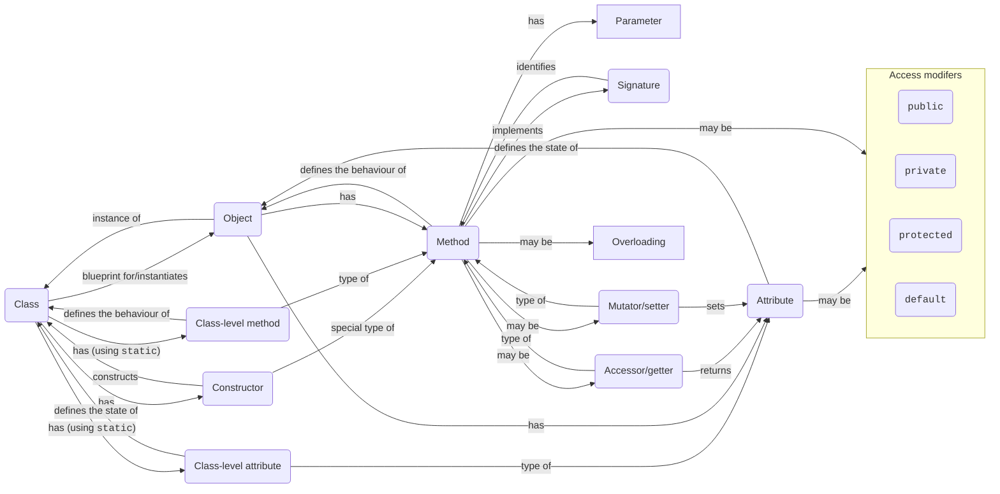
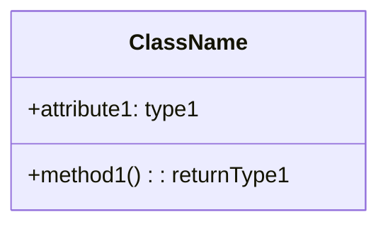
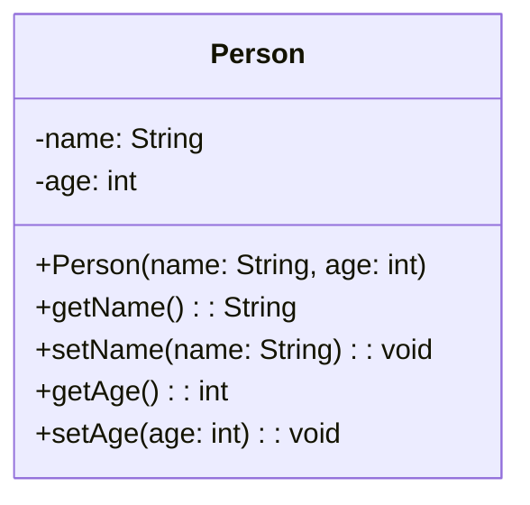
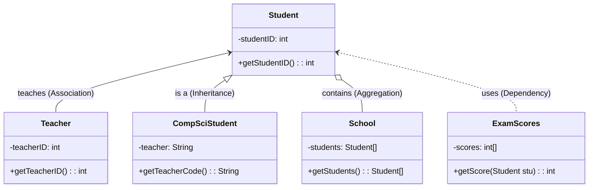

# 04 OOP Intro + Java

## 4 Pillars of OOP

- [**Abstraction**](./01.md#abstraction): **hiding** the **complexity** of an object from the outside world
- [**Encapsulation**](#encapsulation): **wrapping** the data and methods that manipulate the data into a single unit
- [**Inheritance**](#inheritance): **extending** the functionality of an existing class
- **Polymorphism**: defining **unique behaviours** in child classes and share **common behaviours** with parent classes

## Concept of an Object

!!! info "Syllabus points"
    - D.1.1 Outline the general nature of an object
    - D.1.2 Distinguish between an object (definition, template or class) and instantiation
    - D.1.9 Explain the need for different data types to represent data items
    - D.1.10 Describe how data items can be passed to and from actions as parameters

- **Class**: a **blueprint/template** for an object
- **Object**: a specific **instance** of a class
- **Attributes**: variables that describe the **states** of the object
- **Methods**: functions that describe the **behaviours** of the object
- **Class-level attributes/methods**: attributes/methods that are shared by **all objects** of the class (`static`)
- **Constructor**: a **special method** that is called when an object is created (**instantiated**)
    - It **initialises** the object (sets the initial values of the instance variables)
    - It does not have a **return type**
- **Accessor/getter**: a method that **returns** the value of an attribute
- **Mutator/setter**: a method that **sets** the value of an attribute
- **Parameter**: a variable that is used in a **method definition**
- **Signature**: the **name** and **parameter types** of a method
- **Overloading**: defining multiple methods with the **same name** but **different signatures**
- Access modifers
    - `public`: accessible from **anywhere**
    - `private`: only accessible from **within the class**
    - `protected`: only accessible from **within the class and its subclasses**
    - `default`: only accessible from **within the package**



```java
public class Person {
    // Class-level attributes
    private static int count = 0;

    // Instance-level attributes
    private String name;
    private int age;

    // Constructor
    public Person(String name, int age) {
        // `this` refers to the current object
        this.name = name;
        this.age = age;
    }

    // Overloaded constructor
    public Person(String name) {
        // Calls the constructor above
        this(name, 0);
    }

    // Accessor
    public String getName() {
        return name;
    }

    // Mutator
    public void setName(String name) {
        this.name = name;
    }

    public int getAge() {
        return age;
    }

    public void setAge(int age) {
        this.age = age;
    }
}
```

### Classes vs Objects

#### Similarities

- Both can have **attributes** and **methods**
- Both can have **access levels**

#### Differences

- Classes are **blueprints/templates** for objects
- Classes do not allocate **memory** when they are created, but objects do
- Classes are declared using the **`class` keyword**, but objects are created using the **`new` keyword**
- Classes are created **once**, but objects can be created **multiple times**

### `this` keyword

`this` keyword can be very useful in the handling of **variable hiding** (when a local variable has the same name as an instance variable).

```java hl_lines="5 6"
public class Person {
    private String name;

    public Person(String name) {
        // `this` refers to the current object
        this.name = name;
    }
}
```

`this` can also be used to **call another constructor** in the same class when overloading (explicit constructor invocation).

```java hl_lines="5 6 11 12"
public class Person {
    private String name;

    public Person(String name) {
        // `this` refers to the current object
        this.name = name;
    }

    // Overloaded constructor
    public Person(String name) {
        // Calls the constructor above
        this(name, 0);
    }
}
```

!!! warning "Attention"
    - `this` keyword can only be the first statement in Constructor.
    - A constructor can have either `this` or `super` keyword, but not both.

### `static` keyword

!!! summary
    - Static (class-level) attributes and methods include **keyword `static`** and can be `public` or `private`.
    - Static variables belong to a **class**, not the objects of the class, but are shared by **all objects**.
    - Static variables are accessed with `ClassName.variableName`.
    - Instance variables can access or change the values of static variables. Static variables cannot access or change instance variables, but they can access or change the values of other static variables.

The `static` keyword is used to create **class-level attributes/methods** that belong to the **class** itself, and are **shared** by all objects of the class.

Static attributes and methods can be `public` or `private`, and the `static` keyword is usually placed **after** the access modifiers (`public``,`private`, etc.).

```java
public class Person {
    // Class-level attributes
    private static int count = 0;

    public static int getCount() {
        return count;
    }

    public static void setCount(int count) {
        Person.count = count;
    }
}

// Accessing static attributes/methods
Person.setCount(10);
System.out.println(Person.getCount());

// You can also access static attributes/methods using an object
Person p = new Person();
p.setCount(10);
System.out.println(p.getCount());

// Static variables are shared by all objects
Person p1 = new Person();
Person p2 = new Person();
p1.setCount(10);
System.out.println(p2.getCount()); // 10
```

| Feature           | Non-static/instance variable                      | Static/class variable                     |
| ----------------- | ------------------------------------------------- | ----------------------------------------- |
| Keyword           | None                                              | `static`                                  |
| Memory allocation | Multiple times (whenever a new object is created) | Only once (when class is created)         |
| Scope             | Specific to an object                             | Common for every object of the same class |
| Accessed with     | Object reference (`obj.var`)                      | Class reference (`Cls.var`)               |

#### `static` blocks

`static` blocks are used to initialise static attributes all at once. They are executed **once** when the class is loaded.

```java
public class Person {
    private static int count = 0;

    static {
        count = 10;
    }

    // You can even execute code here
    static {
        System.out.println("Hello world!");
        count = 20;
    }
}
```

### Record handling and using arrays

A **record** is essentially the same as a **Java object** that has **instance variables only**, but **no instance methods**. The **data items** in a record (instance variables) are called the **fields** of the record. Each item is referred to using a **field name** (names of the instance variables).

The distinguishing characteristics of a record are that the data items in the record are referred to by **name** and that different fields in a record are allowed to be of **different types** (compared to arrays, where all elements are referred to by index and must be of the same type).

```java
public class Person {
    // Fields
    private String name;
    private int age;
    private String address;
    private String phone;

    // Constructor
    public Person(String name, int age, String address, String phone) {
        this.name = name;
        this.age = age;
        this.address = address;
        this.phone = phone;
    }

    public String toString() {
        return "Name: " + name + ", Age: " + age + ", Address: " + address + ", Phone: " + phone;
    }
}
```

## Constructors, Accessors & Mutators

!!! info "Syllabus points"
    - D.3.1 Define the terms: class, identifier, primitive, instance variable, parameter variable, local variable
    - D.3.2 Define the terms: method, accessor, mutator, constructor, ... return value
    - D.3.3 Define the terms: private, … public, ... static
    - D.3.4 Describe the uses of the primitive data types and the reference class string

See [above](#concept-of-an-object).

## Unified Modeling Language (UML)

!!! info "Syllabus points"
    - D.3.1 Define the terms: class, identifier, primitive, instance variable, parameter variable, local variable
    - D.3.2 Define the terms: method, accessor, mutator, constructor, ... return value
    - D.3.3 Define the terms: private, … public, ... static
    - D.3.4 Describe the uses of the primitive data types and the reference class string

A **Unified Modeling Language (UML)** diagram is a **graphical representation** of a **system**. It is a **standard** way of visualizing a software system using a collection of **diagrams**.

### Class diagram

A **class diagram** is a **static** view of a system. It shows the **classes** and their **attributes**, **operations** (or **methods**), and the **relationships** among objects. It is the **building block** of object-oriented analysis and design.

The class diagram has three main components:

- Top: **Class name**, bold and centred
- Middle: **Attributes**, left-aligned
- Bottom: **Methods**, left-aligned



The **visibility** of the attribute/method is **indicated** by a **symbol**:

- `+` : `public`
- `-` : `private`
- `#` : `protected`
- `~` : `default` (`package`)

Each attribute is followed by a **colon** and by the **data type** of the variable. For methods, the **return values** follow.



In this example, the `Person` class has two `private` attributes (`name` and `age`), a `public` constructor and four `public` methods (`getName`, `setName`, `getAge`, `setAge`).

### Relationships



## Multiple Classes & Sub-Classes

### Encapsulation

**Encapsulation** (data hiding) is the technique of making variables in a class **private** and providing access to the fields via **public methods**.

Encapsulation acts as a **protective barrier** that prevents the code and data from being **randomly accessed** by other code defined outside the class. Access to the data and code is **tightly controlled** by an interface.

```java
public class Person {
    // Instead of having `public` attributes, we use `private`...
    private String name;

    // ...and use public accessors/mutators
    public String getName() {
        return name;
    }
    public void setName(String name) {
        this.name = name;
    }
}
```

Advantages of encapsulation:

- The fields can be made **read-only** or **write-only**.
- A class can have **total control** over what is stored in its fields.
