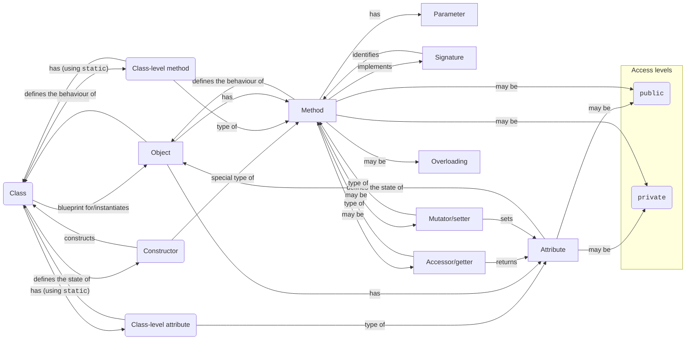

# 04 OOP Intro + Java

## Concept of an Object & Java

- Class: a blueprint for an object
- Object: a specific instance of a class
- Attributes: variables that describe the states of the object
- Methods: functions that describe the behaviours of the object
- Class-level attributes/methods: attributes/methods that are shared by all objects of the class
- Constructor: a special method that is called when an object is created
- Accessor/getter: a method that returns the value of an attribute
- Mutator/setter: a method that sets the value of an attribute
- Parameter: a variable that is used in a method definition
- Signature: the name and parameter types of a method
- Overloading: defining multiple methods with the same name but different signatures
- Access levels
    - `public`: accessible from anywhere
    - `private`: only accessible from within the class



```java
public class Person {
    // Attributes
    private String name;
    private int age;

    // Constructor
    public Person(String name, int age) {
        // `this` refers to the current object
        this.name = name;
        this.age = age;
    }

    // Overloaded constructor
    public Person(String name) {
        // Calls the constructor above
        this(name, 0);
    }

    // Accessor
    public String getName() {
        return name;
    }

    // Mutator
    public void setName(String name) {
        this.name = name;
    }

    public int getAge() {
        return age;
    }

    public void setAge(int age) {
        this.age = age;
    }
}
```
