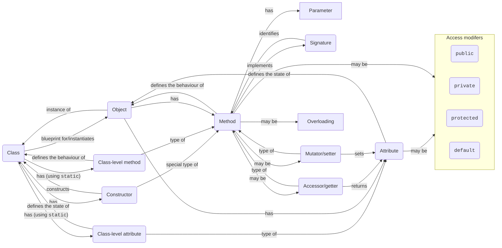
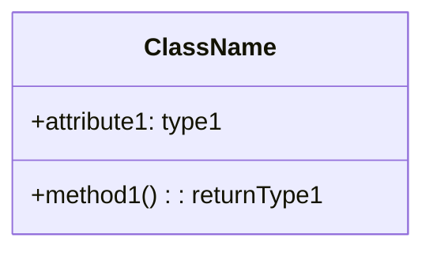
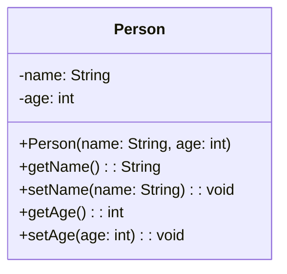
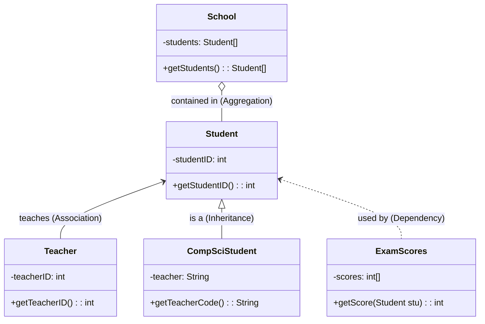

# 04 OOP Intro + Java

## 4 Pillars of OOP

- [**Abstraction**](./01.md#abstraction): **hiding** the **complexity** of an object from the outside world
- [**Encapsulation**](#encapsulation): **wrapping** the data and methods that manipulate the data into a single unit
- [**Inheritance**](#inheritance): **extending** the functionality of an existing class
- [**Polymorphism**](#polymorphism): using **a single interface** to perform **different actions** based on the type of object

## Key vocabulary

- **Class**: a **blueprint/template** for an object
- **Object**: a specific **instance** of a class
- **Attributes**: variables that describe the **states** of the object
- **Methods**: functions that describe the **behaviours** of the object
- **Class-level attributes/methods**: attributes/methods that are shared by **all objects** of the class (`static`)
- **Constructor**: a **special method** that is called when an object is created (**instantiated**)
    - It **initialises** the object (sets the initial values of the instance variables)
    - It does not have a **return type**
- **Accessor/getter**: a method that **returns** the value of an attribute
- **Mutator/setter**: a method that **sets** the value of an attribute
- **Parameter**: a variable that is used in a **method definition**
- **Signature**: the **name** and **parameter types** of a method
- **Overloading**: defining multiple methods with the **same name** but **different signatures**
- **Access modifiers** (see [below](#access-modifiers))



```java
public class Person {
    // Class-level attributes
    private static int count = 0;

    // Instance-level attributes
    private String name;
    private int age;

    // Constructor
    public Person(String name, int age) {
        // `this` refers to the current object
        this.name = name;
        this.age = age;
    }

    // Overloaded constructor
    public Person(String name) {
        // Calls the constructor above
        this(name, 0);
    }

    // Accessor
    public String getName() {
        return name;
    }

    // Mutator
    public void setName(String name) {
        this.name = name;
    }

    public int getAge() {
        return age;
    }

    public void setAge(int age) {
        this.age = age;
    }
}
```

## Concept of an Object

!!! info "Syllabus points"
    - D.1.1 Outline the general nature of an object
    - D.1.2 Distinguish between an object (definition, template or class) and instantiation
    - D.1.9 Explain the need for different data types to represent data items
    - D.1.10 Describe how data items can be passed to and from actions as parameters

See [above](#key-vocabulary) for definitions.

### Classes vs Objects

- Similarities
    - Both can have **attributes** and **methods**
    - Both can have **access levels**
- Differences
    - Classes are **blueprints/templates** for objects
    - Classes do not allocate **memory** when they are created, but objects do
    - Classes are declared using the **`class` keyword**, but objects are created using the **`new` keyword**
    - Classes are created **once**, but objects can be created **multiple times**

### `this` keyword

`this` keyword can be very useful in the handling of **variable hiding** (when a local variable has the same name as an instance variable).

```java hl_lines="5 6"
public class Person {
    private String name;

    public Person(String name) {
        // `this` refers to the current object
        this.name = name;
    }
}
```

`this` can also be used to **call another constructor** in the same class when overloading (explicit constructor invocation).

```java hl_lines="5 6 11 12"
public class Person {
    private String name;

    public Person(String name) {
        // `this` refers to the current object
        this.name = name;
    }

    // Overloaded constructor
    public Person(String name) {
        // Calls the constructor above
        this(name, 0);
    }
}
```

!!! warning "Attention"
    - `this` keyword can only be the first statement in the constructor.
    - A constructor can have either `this` or `super` keyword, but not both.
    - `this` cannot be used in a static context, as static code is not associated with any object.

### `static` keyword

!!! summary
    - Static (class-level) attributes and methods include **keyword `static`** and can be `public` or `private`.
    - Static variables belong to a **class**, not the objects of the class, but are shared by **all objects**.
    - Static variables are accessed with `ClassName.variableName`.
    - Instance variables can access or change the values of static variables. Static variables cannot access or change instance variables, but they can access or change the values of other static variables.

The `static` keyword is used to create **class-level attributes/methods** that belong to the **class** itself and are **shared** by all objects of the class.

Static attributes and methods can be `public` or `private`, and the `static` keyword is usually placed **after** the [access modifiers](#access-modifiers).

```java
public class Person {
    // Class-level attributes
    private static int count = 0;

    public static int getCount() {
        return count;
    }

    public static void setCount(int count) {
        Person.count = count;
    }
}

// Accessing static attributes/methods
Person.setCount(10);
System.out.println(Person.getCount());

// You can also access static attributes/methods using an object
Person p = new Person();
p.setCount(10);
System.out.println(p.getCount());

// Static variables are shared by all objects
Person p1 = new Person();
Person p2 = new Person();
p1.setCount(10);
System.out.println(p2.getCount()); // 10
```

| Feature           | Non-static/instance variable                      | Static/class variable                     |
| ----------------- | ------------------------------------------------- | ----------------------------------------- |
| Keyword           | None                                              | `static`                                  |
| Memory allocation | Multiple times (whenever a new object is created) | Only once (when class is created)         |
| Scope             | Specific to an object                             | Common for every object of the same class |
| Accessed with     | Object reference (`obj.var`)                      | Class reference (`Cls.var`)               |

#### `static` blocks

`static` blocks are used to initialise static attributes all at once. They are executed **once** when the class is loaded.

```java
public class Person {
    private static int count = 0;

    static {
        count = 10;
    }

    // You can even execute code here
    static {
        System.out.println("Hello world!");
        count = 20;
    }
}
```

### Record handling and using arrays

A **record** is essentially the same as a **Java object** that has **instance variables only**, but **no instance methods**. The **data items** in a record (instance variables) are called the **fields** of the record. Each item is referred to using a **field name** (names of the instance variables).

The distinguishing characteristics of a record are that the data items in the record are referred to by **name** and that different fields in a record are allowed to be of **different types** (compared to arrays, where all elements are referred to by index and must be of the same type).

```java
public class Person {
    // Fields
    private String name;
    private int age;
    private String address;
    private String phone;

    // Constructor
    public Person(String name, int age, String address, String phone) {
        this.name = name;
        this.age = age;
        this.address = address;
        this.phone = phone;
    }

    public String toString() {
        return "Name: " + name + ", Age: " + age + ", Address: " + address + ", Phone: " + phone;
    }
}
```

## Constructors, Accessors & Mutators

!!! info "Syllabus points"
    - D.3.1 Define the terms: class, identifier, primitive, instance variable, parameter variable, local variable
    - D.3.2 Define the terms: method, accessor, mutator, constructor, ... return value
    - D.3.3 Define the terms: private, … public, ... static
    - D.3.4 Describe the uses of the primitive data types and the reference class string

See [above](#key-vocabulary) for definitions.

## Unified Modeling Language (UML)

!!! info "Syllabus points"
    - D.3.1 Define the terms: class, identifier, primitive, instance variable, parameter variable, local variable
    - D.3.2 Define the terms: method, accessor, mutator, constructor, ... return value
    - D.3.3 Define the terms: private, … public, ... static
    - D.3.4 Describe the uses of the primitive data types and the reference class string

A **Unified Modeling Language (UML)** diagram is a **graphical representation** of a **system**. It is a **standard** way of visualizing a software system using a collection of **diagrams**.

### Class diagram

A **class diagram** is a **static** view of a system. It shows the **classes** and their **attributes**, **operations** (or **methods**), and the **relationships** among objects. It is the **building block** of object-oriented analysis and design.

The class diagram has three main components:

- Top: **Class name**, bold and centred
- Middle: **Attributes**, left-aligned
- Bottom: **Methods**, left-aligned



The **visibility** (see [Access modifiers](#access-modifiers)) of the attribute/method is **indicated** by a **symbol**:

- `+`: `public`
- `-`: `private`
- `#`: `protected`
- `~`: default

Each attribute is followed by a **colon** and by the **data type** of the variable. For methods, the **return values** follow.



In this example, the `Person` class has two `private` attributes (`name` and `age`), a `public` constructor and four `public` methods (`getName`, `setName`, `getAge`, `setAge`).

### Relationships

!!! warning "Attention"
    The diamond for aggregation is always pointed towards the **container**, not the contained. (i.e. instead of a "have-a" relationship, it is a "being-had-by" relationship).



## Multiple Classes & Sub-Classes

!!! info "Syllabus points"
    - D.2.1 Define the term encapsulation
    - D.2.2 Define the term inheritance
    - D.2.3 Define the term polymorphism
    - D.2.4 Explain the advantages of encapsulation
    - D.2.5 Explain the advantages of inheritance
    - D.2.6 Explain the advantages of polymorphism

### Access modifiers

| Access level      | `public` | `protected`     | default | `private` |
| ----------------- | -------- | --------------- | ------- | --------- |
| Same package      | yes      | yes             | yes     | no        |
| Different package | yes      | subclasses only | no      | no        |

#### `public`

- Can be accessed from **everywhere**
- In Java, a source file can only have **one** `public` class with the same name as the file

#### `protected`

- Can be accessed from:
    - Within the **same class**
    - Everywhere from the **same package**
    - **Subclasses** everywhere (regardless of which package)
- Cannot be used with **top-level classes** (only when nested)

#### default (no specifier)

- Can be accessed from:
    - Within the **same class**
    - Everywhere from the **same package**
- Convenient for **package-private** classes

#### `private`

- Can be accessed from **within the same class** only
- **Not visible** to or **inheritable** by subclasses
- Mostly used for [**encapsulation**](#encapsulation)

#### Visibility in inheritance

- `public` variables in a superclass must be `public` in subclasses.
- `protected` variables in a superclass must either be `protected` or `public` in subclasses; they cannot be `private`.
- `private` variables are never inherited.

### Encapsulation

**Encapsulation** (data hiding) is the technique of making variables in a class **private** and providing access to the fields via **public methods**.

Encapsulation acts as a **protective barrier** that prevents the code and data from being **randomly accessed** by other code defined outside the class. Access to the data and code is **tightly controlled** by an interface.

Advantages of encapsulation:

- Improves **maintainability**, **flexibility** and **re-usability**: **implementation** is purely **hidden** from outside classes, thus can be **changed** without affecting dependent code
- Ability to create a **read-only** or **write-only** field (by not providing a getter or setter)
- A class can have **total control** over what is stored in its fields (ability to e.g. validate)

Steps to encapsulate a class:

1. Make the fields `private`
2. Create accessors and mutators (getters and setters) for the fields

```java
public class Person {
    // Instead of having `public` attributes, we use `private`...
    private String name;

    // ...and use public accessors/mutators
    public String getName() {
        return name;
    }
    public void setName(String name) {
        this.name = name;
    }
}
```

### Getters and setters

A getter method returns the value of an attribute. A setter method takes a parameter and assigns it to the attribute.

They control how important variables are **accessed** and **updated**. For example:

```java
public void setNumber(int number) {
    if (number < 1 || number > 10) {
        System.out.println("Number not in correct range");
        return;
    }
    this.number = num;
}
```

This setter can be used to **validate** the value of the variable to be within a range before it is assigned.

### Inheritance

Inheritance is a mechanism in which one class acquires the **properties** (methods and fields) of another (**extends**).

Inheritance defines an **is-a** relationship.

```java
public class Animal {
    public void eat() {
        System.out.println("Animal is eating");
    }
}

public class Dog extends Animal {
    public void bark() {
        System.out.println("Dog is barking");
    }
}

Dog d = new Dog();
d.eat();
d.bark();
```

#### `super` keyword

The `super` keyword is similar to `this` but refers to the **superclass**. It can be used to access the superclass variables and call the superclass constructor.

```java hl_lines="15 16 17 18 22 23"
public class Animal {
    protected String name;

    public Animal() {
        System.out.println("Animal constructor");
    }

    public void eat() {
        System.out.println("Animal is eating");
    }
}

public class Dog extends Animal {
    public Dog(String name) {
        // Calling the superclass constructor
        super();
        // Using super to modify a superclass attribute
        super.name = name;
        System.out.println("Dog constructor (" + name + ")");
    }

    public void eat() {
        // Using super to call a superclass method
        super.eat();
        System.out.println("Dog is eating");
    }
}

Dog d = new Dog("Fido");
d.eat();
// Output:
// Animal constructor
// Dog constructor (Fido)
// Animal is eating
// Dog is eating
```

#### Limitations of Java inheritance

- **Private** members of the superclass are **not inherited** by the subclass and can only be **indirectly accessed**.
- Members that have **default accessibility** in the superclass are also **not inherited** by subclasses **in other packages**, as these members are only accessible by their names in subclasses **within the same package** as the superclass.
- Since **constructors** and **initializer blocks** are not members of a class, they are not inherited by a subclass.
- A subclass can extend only **one superclass**.

#### Types of inheritance

- Single inheritance

    ```mermaid
    classDiagram
        class Animal {
            +eat()
        }
        class Dog {
            +bark()
        }
        Animal <|-- Dog
    ```

    ```java
    public class Animal {
        public void eat() {
            System.out.println("Animal is eating");
        }
    }

    public class Dog extends Animal {
        public void bark() {
            System.out.println("Dog is barking");
        }
    }
    ```

- Multi-level inheritance

    ```mermaid
    classDiagram
        class Animal {
            +eat()
        }
        class Dog {
            +bark()
        }
        class BabyDog {
            +weep()
        }
        Animal <|-- Dog
        Dog <|-- BabyDog
    ```

    ```java
    public class Animal {
        public void eat() {
            System.out.println("Animal is eating");
        }
    }

    public class Dog extends Animal {
        public void bark() {
            System.out.println("Dog is barking");
        }
    }

    public class BabyDog extends Dog {
        public void weep() {
            System.out.println("Baby dog is weeping");
        }
    }
    ```

- Hierarchical inheritance

    ```mermaid
    classDiagram
        class Animal {
            +eat()
        }
        class Dog {
            +bark()
        }
        class Cat {
            +meow()
        }
        Animal <|-- Dog
        Animal <|-- Cat
    ```

    ```java
    public class Animal {
        public void eat() {
            System.out.println("Animal is eating");
        }
    }

    public class Dog extends Animal {
        public void bark() {
            System.out.println("Dog is barking");
        }
    }

    public class Cat extends Animal {
        public void meow() {
            System.out.println("Cat is meowing");
        }
    }
    ```

#### Benefits of inheritance

- Code **reuse**: child classes use the code in the parent class **without re-writing**, which saves **time and effort**
- Clear **model structure**: easy to understand
- **Overriding** parents: meaningful implementation can be designed in the subclass, less **development** and **maintenance** costs
- Base classes can still decide to keep some data **private** to prevent alteration by the derived class

#### Drawbacks of inheritance

- Decreases **execution speed**: program jumps through levels of **overloaded classes**
- Makes the parents and children **tightly coupled**: cannot be used **independently** of each other
- **Changes** made in the parent class will **affect child classes**
- Overusing inheritance makes the program more **complex**

### Polymorphism

Polymorphism allows us to perform **a single action** in **different ways**. A method can do **different things** based on the object that it is acting upon. In other words, polymorphism allows you to define **one interface** and have **multiple implementations**.

#### Overloading

Method overloading is a feature that allows a class to have more than one method with **the same name** but different **argument lists**, **return types**, **access modifiers** and/or **exceptions**. Methods **inherited** from a superclass can also be overloaded in a subclass.

To call an overloaded method, you must specify the **type** and **number** of arguments. The Java compiler will then select the **most appropriate** method to call based on the arguments. This is called **compile-time (static binding) polymorphism**.

```java
public class Adder {
    static int add(int a, int b) {
        return a + b;
    }
    static double add(double a, double b) {
        // add() is overloaded here with different arguments and return type
        // (i.e. different method signature)
        return a + b;
    }
}

int sum1 = Adder.add(10, 20);
double sum2 = Adder.add(10.5, 20.5);
```

#### Overriding

Method overriding is a feature that allows a subclass to **override** a method in its parent class. Overridden methods must have the **same method name** as the method in the parent class, and the **return type** must be the **same** or a **subclass** of the original return type. The **access modifier** and **exceptions** of the overridden method can only be **more restrictive** than the parent class method.

**Static** methods, **final** methods and **constructors** cannot be overridden.

!!! warning "Attention"
    If the argument list of a subclass method is different from the parent method, the method is [**overloaded**](#overloading), not overridden.

**The type of the object** determines which version of the method will be called, as opposed to the type of the reference variable. This is called **runtime (dynamic binding) polymorphism**.

```java
public class Animal {
    public void eat() {
        System.out.println("Animal is eating");
    }
}

public class Dog extends Animal {
    // The options @Override annotation helps the compiler
    // ensure that the method is actually overridden in case of
    // e.g. typos in the method name
    @Override
    public void eat() {
        // eat() is overridden here
        // If the parent method needs to be called, we can use super.eat()
        System.out.println("Dog is eating");
    }
}
```

#### Benefits of polymorphism

- Allows the programming to **extend itself**
- Helps the programmer to **reuse** the code, i.e., classes once written, tested and implemented can be reused as required. Saves a lot of time.
A single variable can be used to store multiple data types. The user would be able to store several variables of different types (double, Float, Int, Long, etc) in a single variable. This would make it easier for the user to search for and implement these variables.
Easy to debug the codes.
