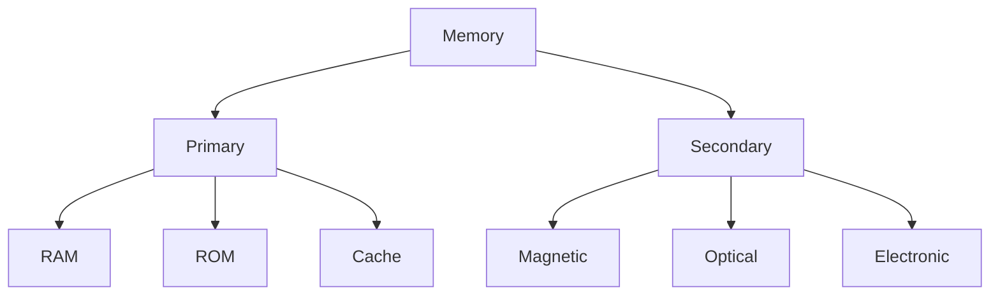
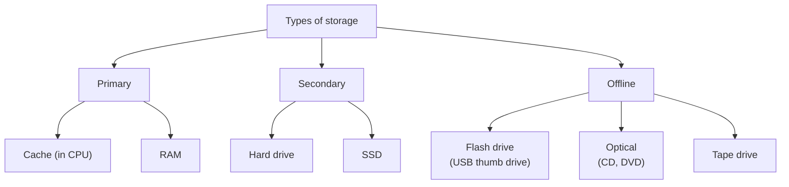

# 06 Computer Organisation

## Binary Representation

!!! info "Syllabus points"
    - 2.1.9 Define the terms: bit, byte, binary, denary/decimal, hexadecimal
    - 2.1.10 Outline the way in which data is represented in the computer

See [SL03c](03c.md).

## Simple Logic Gates

!!! info "Syllabus points"
    - 2.1.11 Define the Boolean operators: AND, OR, NOT, NAND, NOR and XOR
    - 2.1.12 Construct truth tables using the above operators
    - 2.1.13 Construct a logic diagram using AND, OR, NOT, NAND, NOR and XOR gates

See [SL02a](02a.md#boolean-algebra).

## Computer Architecture

!!! info "Syllabus points"
    - 2.1.1 Outline the architecture of the central processing unit (CPU) and the functions of the arithmetic logic unit (ALU) and the control unit (CU) and the registers within the CPU
    - 2.1.2 Describe primary memory
    - 2.1.3 Explain the use of cache memory
    - 2.1.4 Explain the machine instruction cycle

### CPU architecture

- CPU: contains the circuitry necessary to **fetch, decode and execute** program instructions from and to main memory (RAM)
- ALU: part of the CPU that does all the **arithmetic** (+/-) and **logical**
(AND/OR) calculations; sometimes referred to as a **"core"** (e.g. dual core = 2 ALUs to process 2 calculations **simultaneously**)
- CU: handles the **loading** of new commands into the CPU and the **decoding** of these commands; directs the **data flow** and the **operation** of the ALU
- Register (CPU's own "memory"): small, very fast circuits that store **intermediate values** from calculations or instructions inside the CPU
    - MAR: connected to the **address bus**, contains the **memory address** of the **next instruction** to be fetched
    - MDR: connected to the **data bus**, holds data that will be **written to** or was **read from** RAM
    - Accumulator (out of syllabus)
- Bus: a wire that connects the CPU to **other devices**, normally **built into the motherboard**
    - Data bus (links RAM to CPU via MDR)
    - Control bus (links RAM to CPU via CU)
    - Memory bus (links RAM to CPU via MAR)

### Primary memory

!!! note "See also"
    [HL04 Resource Management § Resources to manage](../HL/04.md#resources-to-manage)

- RAM (Random Access Memory/primary memory)
    - Contains the data and instructions the computer has loaded since **starting up** and everything the user has opened/loaded
    - **Volatile** (loses its contents if power is lost)
    - Has a special link to the CPU (via **busses**)
- ROM (Read Only Memory)
    - Usually static (**read-only**) except flash upgrades
    - **Non-volatile** (does not lose its contents if power is lost)
    - Stores the BIOS (Basic Input Output System): a small program that allows the computer to find the **operating system** to "boot" the computer after power is restored

| RAM                                                  | ROM                                               |
| ---------------------------------------------------- | ------------------------------------------------- |
| Volatile                                             | Non-volatile                                      |
| Contains programs and data loaded since "booting up" | Contains the BIOS                                 |
| Usually upgradeable, can be increased                | Usually part of motherboard, difficult to upgrade |

### Cache memory

A type of **small, high-speed memory** inside the CPU used to hold **frequently used data**, so that the CPU needs to access the much slower RAM **less frequently**.

### The machine instruction cycle

- "Fetch-decode-execute" cycle (FDE/machine cycle)
- Fetches the instruction from memory, decodes and executes
- Repeat from startup to shutdown

Procedure:

1. PC contains the address of the next instruction to be fetched
2. Address in PC copied to MAR via address bus (MAR points to an address)
3. Instruction copied from the memory location in MAR and placed in MDR via data bus
4. Instruction copied from MDR and placed in CIR via data bus
5. Address part of instruction placed in MAR
6. PC increments
7. Instruction decoded in CU
8. Instruction executed in ALU

## Secondary Memory

!!! info "Syllabus points"
    - 2.1.5 Identify the need for persistent storage

We need secondary storage because:

- CPU has no permanent storage (only **registers** for temporary processing)
- RAM is **volatile** (loses contents if power is lost)
- Results/data need to be stored on a **persistent storage**

## Operating Systems & Application Systems

!!! info "Syllabus points"
    - 2.1.6 Describe the main functions of an operating system
    - 2.1.7 Outline the use of a range of application software
    - 2.1.8 Identify common features of applications, which include:
        - toolbars,
        - menus,
        - dialogue boxes,
        - graphical user interface (GUI) components.

See [SL03b](03b.md).
